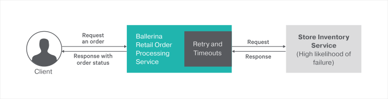

[](https://travis-ci.org/ballerina-guides/resiliency-circuit-breaker)

# Circuit Breaker
The [circuit breaker pattern](https://martinfowler.com/bliki/CircuitBreaker.html) is a way to automatically degrade functionality when remote services fail. When you use the circuit breaker pattern, you can allow a web service to continue operating without waiting for unresponsive remote services.

> This guide walks you through the process of adding a circuit breaker pattern to a potentially-failing remote backend. 

The following are the sections available in this guide.

- [What you'll build](#what-youll-build)
- [Prerequisites](#prerequisites)
- [Implementation](#implementation)
- [Testing](#testing)
- [Deployment](#deployment)
- [Observability](#observability)

## What you'll build

You’ll build a web service that uses the Circuit Breaker pattern to gracefully degrade functionality when a remorte backend fails. To understand this better, you'll be mapping this with a real world scenario of an order processing service of a retail store. The retail store uses a potentially-failing remote backend for inventory management. When a specific order comes to the order processing service, the service calls the inventory management service to check the availability of items.

&nbsp;
&nbsp;
&nbsp;
&nbsp;



&nbsp;
&nbsp;
&nbsp;

**Place orders through retail store**: To place a new order you can use the HTTP POST message that contains the order details

## Prerequisites
 
- [Ballerina Distribution](https://ballerina.io/learn/getting-started/)
- A Text Editor or an IDE 

### Optional requirements
- Ballerina IDE plugins ([VSCode](https://marketplace.visualstudio.com/items?itemName=ballerina.ballerina), [IntelliJ IDEA](https://plugins.jetbrains.com/plugin/9520-ballerina))
- [Docker](https://docs.docker.com/engine/installation/)
- [Kubernetes](https://kubernetes.io/docs/setup/)

## Implementation

> If you want to skip the basics, you can download the git repo and directly move to the "Testing" section by skipping  "Implementation" section.
### Create the project structure

Ballerina is a complete programming language that can have any custom project structure that you wish. Although the language allows you to have any package structure, use the following package structure for this project to follow this guide.
```
resiliency-circuit-breaker
 └── guide
     ├── inventory_services
     │   ├── inventory_service.bal
     │   └── tests
     │       └── inventory_service_test.bal
     ├── order_services
     │   ├── order_service.bal
     │   └── tests
     │       └── order_service_test.bal
     └── tests
         └── integration_test.bal
```

- Create the above directories in your local machine and also create empty `.bal` files.

- Then open the terminal and navigate to `resiliency-circuit-breaker/guide` and run Ballerina project initializing toolkit.
```bash
   $ ballerina init
```

The order service is the service which handles the client orders. Order service is configured with a circuit breaker to deal with the potentially-failing remote inventory management service.

The inventory service is an independent web service that accepts orders via HTTP POST method from the order service and sends the availability of order items.

### Developing the Ballerina services with circuit breaker

The `ballerina/http` package contains the circuit breaker implementation. After importing that package you can create
a client with a circuit breaker. `http:Client` allows establishing a connection with a remote party (endpoint), circuit breaker configurations could be provided while initializing the client. 
The following code segment will add the circuit breaker capabilities for the endpoint.

```ballerina
http:Client circuitBreakerEP = new("http://localhost:9092", config = {
        // The 'circuitBreaker' term incorporate circuit breaker pattern to the client endpoint
        // Circuit breaker will immediately drop remote calls if the endpoint exceeded the failure threshold
        circuitBreaker: {
            // Failure calculation window. This is how long Ballerina
            // circuit breaker keeps the statistics for the operations.
            rollingWindow: {

                // Time period in milliseconds for which the failure threshold
                // is calculated.
                timeWindowMillis: 10000,

                // The granularity at which the time window slides.
                // This is measured in milliseconds.
                // The `RollingWindow` is divided into buckets
                //  and slides by these increments.
                // For example, if this timeWindowMillis is set to
                // 10000 milliseconds and bucketSizeMillis is set to 2000,
                // RollingWindow breaks into sub windows with
                // 2-second buckets and stats are collected with
                // respect to the buckets
                bucketSizeMillis: 2000,

                // Minimum number of requests in a `RollingWindow`
                // that will trip the circuit.
                requestVolumeThreshold: 0
            },
            // The threshold for request failures.
            // When this threshold exceeds, the circuit trips.
            // This is the ratio between failures and total requests
            //  and the ratio is considered only within the configured
            // `RollingWindow`
            failureThreshold: 0.2,

            // The time period (in milliseconds) to wait before
            // attempting to make another request to the upstream service.
            // When the failure threshold exceeds, the circuit trips to
            // `OPEN` state. Once the circuit is in `OPEN` state
            // circuit breaker waits for the time configured in `resetTimeMillis`
            // and switch the circuit to the `HALF_OPEN` state.
            resetTimeMillis: 10000,

            // HTTP response status codes that are considered as failures
            statusCodes: [400, 404, 500]

        },
        timeoutMillis: 2000
    });
```

You can pass the `Rolling Window`, `Failure Threshold`, `Status Codes` and `Reset Timeout` to the circuit breaker. The `circuitBreakerEP` is the reference for the HTTP endpoint with the circuit breaker. Whenever you call that remote HTTP endpoint, it goes through the circuit breaker. See the below code for the complete implementation of order service circuit breaker

#### order_service.bal
```ballerina
import ballerina/log;
import ballerina/mime;
import ballerina/http;

listener http:Listener orderServiceListener = new(9090);

http:Client circuitBreakerEP = new("http://localhost:9092", config = {
        // The 'circuitBreaker' term incorporate circuit breaker pattern to the client endpoint
        // Circuit breaker will immediately drop remote calls if the endpoint exceeded the failure threshold
        circuitBreaker: {
            // Failure calculation window. This is how long Ballerina
            // circuit breaker keeps the statistics for the operations.
            rollingWindow: {

                // Time period in milliseconds for which the failure threshold
                // is calculated.
                timeWindowMillis: 10000,

                // The granularity at which the time window slides.
                // This is measured in milliseconds.
                // The `RollingWindow` is divided into buckets
                //  and slides by these increments.
                // For example, if this timeWindowMillis is set to
                // 10000 milliseconds and bucketSizeMillis is set to 2000,
                // RollingWindow breaks into sub windows with
                // 2-second buckets and stats are collected with
                // respect to the buckets
                bucketSizeMillis: 2000,

                // Minimum number of requests in a `RollingWindow`
                // that will trip the circuit.
                requestVolumeThreshold: 0
            },
            // The threshold for request failures.
            // When this threshold exceeds, the circuit trips.
            // This is the ratio between failures and total requests
            //  and the ratio is considered only within the configured
            // `RollingWindow`
            failureThreshold: 0.2,

            // The time period (in milliseconds) to wait before
            // attempting to make another request to the upstream service.
            // When the failure threshold exceeds, the circuit trips to
            // `OPEN` state. Once the circuit is in `OPEN` state
            // circuit breaker waits for the time configured in `resetTimeMillis`
            // and switch the circuit to the `HALF_OPEN` state.
            resetTimeMillis: 10000,

            // HTTP response status codes that are considered as failures
            statusCodes: [400, 404, 500]

        },
        timeoutMillis: 2000
    });

@http:ServiceConfig {
    basePath: "/order"
}
service Order on orderServiceListener {
    @http:ResourceConfig {
        methods: ["POST"],
        path: "/"
    }
    resource function orderResource(http:Caller caller, http:Request request) {
        // Initialize the request and response message to send to the inventory service
        http:Request outRequest = new;
        http:Response inResponse = new;
        // Initialize the response message to send back to client
        // Extract the items from the json payload
        var result = request.getJsonPayload();
        json items;
        if (result is json) {
            items = result.items;
        } else {
            http:Response outResponse = new;
            // Send bad request message to the client if request don't contain order items
            outResponse.setPayload("Error : Please check the input json payload");
            outResponse.statusCode = 400;
            var responseResult = caller->respond(outResponse);
            if (responseResult is error) {
                log:printError("Error occurred while responding", err = responseResult);
            }
            return;
        }
        string orderItems = items.toString();
        log:printInfo("Recieved Order : " + orderItems);
        // Set the outgoing request JSON payload with items
        outRequest.setPayload(untaint items);
        // Call the inventory backend through the circuit breaker
        var response = circuitBreakerEP->post("/inventory", outRequest);
        if (response is http:Response) {
            var responseResult = caller->respond("Order Placed : " + untaint orderItems);
            if (responseResult is error) {
                log:printError("Error occurred while responding", err = responseResult);
            }
        } else if (response is error) {
            // If inventory backend contain errors forward the error message to client
            log:printInfo("Inventory service returns an error :" + <string>response.detail().message);
            var responseResult = caller->respond({ "Error": "Inventory Service did not respond",
                    "Error_message": <string>response.detail().message });
            if (responseResult is error) {
                log:printError("Error occurred while responding", err = responseResult);
            }
            return;
        }
    }
}
```
- With that you have completed the implementation of the order management service with circuit breaker functionalities.

#### inventory_service.bal 
The inventory management service is a simple web service that is used to mock inventory management. This service sends the following JSON message to any request. 
```json
{"Status":"Order Available in Inventory", "items":"requested items list"}
```
Refer to the complete implementation of the inventory management service in the [inventory_service.bal](guide/inventory_services/inventory_service.bal) file.

## Testing 

### Try it out

You can run the services that you developed above, in your local environment. Open your terminal and navigate to `resiliency-circuit-breaker/guide`, and execute the following command.

```bash
    $ ballerina run inventory_services
```

```bash
   $ ballerina run order_services
```

- Invoke the order service by sending an order via the HTTP POST method.
``` bash
   curl -v -X POST -d '{ "items":{"1":"Basket","2": "Table","3": "Chair"}}' \
   "http://localhost:9090/order" -H "Content-Type:application/json"
```
   The order service sends a response similar to the following:
```
   Order Placed : {"1":"Basket","2":"Table","3":"Chair"}
```
- Shutdown the inventory service. Your order service now has a broken remote endpoint for the inventory service.

- Invoke the order service by sending an order via HTTP method.
``` bash
   curl -v -X POST -d '{ "items":{"1":"Basket","2": "Table","3": "Chair"}}' \ 
   "http://localhost:9090/order" -H "Content-Type:application/json"
```
   The order service sends a response similar to the following:
```json
   {"Error":"Inventory Service did not respond", "Error_message":"Connection refused: localhost/127.0.0.1:9092"}
```
   This shows that the order service attempted to call the inventory service and found that the inventory service is not available.

- Invoke the order service again soon after sending the previous request.
``` bash
   curl -v -X POST -d '{ "items":{"1":"Basket","2": "Table","3": "Chair"}}' \ 
   "http://localhost:9090/order" -H "Content-Type
```
   Now the Circuit Breaker is activated since the order service knows that the inventory service is unavailable. This time the order service responds with the following error message.
```json
   {"Error":"Inventory Service did not respond","Error_message":"Upstream service
   unavailable. Requests to upstream service will be suspended for 14451 milliseconds."}
```


### Writing unit tests 

In Ballerina, the unit test cases should be in the same package inside a folder named as 'tests'.  When writing the test functions the below convention should be followed.
- Test functions should be annotated with `@test:Config`. See the below example.
```ballerina
   @test:Config
   function testOrderService() {
```
  
This guide contains unit test cases for each service that we implemented above. 

To run the unit tests, open your terminal and navigate to `resiliency-circuit-breaker/guide`, and run the following commands.
```bash
$ ballerina test inventory_services
$ ballerina test order_services
```

To check the implementation of the test file, refer tests folders in the [repository](https://github.com/ballerina-guides/resiliency-circuit-breaker).

## Deployment

Once you are done with the development, you can deploy the service using any of the methods listed below. 

### Deploying locally

- As the first step, you can build a Ballerina executable archive (.balx) of the services that we developed above. Navigate to `resiliency-circuit-breaker/guide` and run the following commands. 
```
   $ ballerina build order_services
```
```
   $ ballerina build inventory_services
```

- Once the .balx files are created inside the target folder, navigate to the target folder and run them with the following commands. 

```
   $ ballerina run order_services.balx
```
```
   $ ballerina run inventory_services.balx
```

- The successful execution of the service will show us the following output. 
```
   ballerina: initiating service(s) in 'target/order_services.balx'
   ballerina: started HTTP/WS endpoint 0.0.0.0:9090
```
```
   ballerina: initiating service(s) in 'target/inventory_services.balx'
   ballerina: started HTTP/WS endpoint 0.0.0.0:9092
```
### Deploying on Docker

You can run the services that we developed above as a Docker container. As Ballerina platform offers native support for running ballerina programs on containers, you just need to put the corresponding Docker annotations on your service code.
Let's see how we can deploy the order service and inventory service we developed above on Docker.

- In our order service and inventory service, we need to import  `ballerinax/docker;` and use the annotations `@docker:Config` , `@docker:Expose` as shown below to provide the basic Docker image configurations and expose the listener port.

##### order_service.bal
```ballerina
// Other imports
import ballerinax/docker;

@docker:Config {
    registry: "ballerina.guides.io",
    name: "order_service",
    tag: "v1.0"
}

@docker:Expose{}
listener http:Listener orderServiceListener = new(9090);

// http:Client definition for Circuit breaker

@http:ServiceConfig {
    basePath: "/order"
}
service Order on orderServiceListener {
   
``` 

##### inventory_service.bal
```ballerina
// Other imports
import ballerinax/docker;

@docker:Config {
    registry: "ballerina.guides.io",
    name: "inventory_service",
    tag: "v1.0"
}

@docker:Expose{}
listener http:Listener inventoryListener = new(9092);

@http:ServiceConfig {
    basePath: "/inventory"
}
service InventoryService on inventoryListener {

```

- Now you can build a Ballerina executable archive (.balx) of the service that we developed above, using the following command. It points to the service file that we developed above and it will create an executable binary out of that. 
This will also create the corresponding Docker image using the Docker annotations that you have configured above. Navigate to the `<SAMPLE_ROOT>/guide/` folder and run the following command.

```
  $ ballerina build inventory_services

  Run following command to start Docker container:
  docker run -d -p 9092:9092 ballerina.guides.io/inventory_service:v1.0
```
  
- Once you successfully build the Docker image for inventory service, run it with the `docker run` command that is shown in the previous step.

```
    docker run -d -p 9092:9092 ballerina.guides.io/inventory_service:v1.0
```

- Here we run the Docker image with flag `-p <host_port>:<container_port>` so that we use the host port 9092 and the container port 9092. Therefore you can access the service through the host port.
- Once you successfully start inventory service from above command, execute `docker ps` command in the terminal and take corresponding Docker process id for the inventory service. Then execute execute `docker ps <PROCESS_ID>` and take IP address of the inventory service container.

```
   $ docker ps
```

```
   $ docker inspect <PROCESS_ID>
```

- Then update the url of the ``circuitBreakerEP`` of order service with the inventory service container IP address

```ballerina
http:Client circuitBreakerEP = new("http://<IP_ADDRESS_OF_INVENTORY_SERVICE_CONTAINER>:9092", config = {
        // The 'circuitBreaker' term incorporate circuit breaker pattern to the client endpoint
        // Circuit breaker will immediately drop remote calls if the endpoint exceeded the failure threshold
        circuitBreaker: {
            // Failure calculation window. This is how long Ballerina
            // circuit breaker keeps the statistics for the operations.
            rollingWindow: {

                // Time period in milliseconds for which the failure threshold
                // is calculated.
                timeWindowMillis: 10000,

                // The granularity at which the time window slides.
                // This is measured in milliseconds.
                // The `RollingWindow` is divided into buckets
                //  and slides by these increments.
                // For example, if this timeWindowMillis is set to
                // 10000 milliseconds and bucketSizeMillis is set to 2000,
                // RollingWindow breaks into sub windows with
                // 2-second buckets and stats are collected with
                // respect to the buckets
                bucketSizeMillis: 2000,

                // Minimum number of requests in a `RollingWindow`
                // that will trip the circuit.
                requestVolumeThreshold: 0
            },
            // The threshold for request failures.
            // When this threshold exceeds, the circuit trips.
            // This is the ratio between failures and total requests
            //  and the ratio is considered only within the configured
            // `RollingWindow`
            failureThreshold: 0.2,

            // The time period (in milliseconds) to wait before
            // attempting to make another request to the upstream service.
            // When the failure threshold exceeds, the circuit trips to
            // `OPEN` state. Once the circuit is in `OPEN` state
            // circuit breaker waits for the time configured in `resetTimeMillis`
            // and switch the circuit to the `HALF_OPEN` state.
            resetTimeMillis: 10000,

            // HTTP response status codes that are considered as failures
            statusCodes: [400, 404, 500]

        },
        timeoutMillis: 2000
    });
```

- Navigate to the `<SAMPLE_ROOT>/guide/` folder and run the following command.

```
  $ ballerina build order_services --skiptests
  
  Run following command to start Docker container:
  docker run -d -p 9090:9090 ballerina.guides.io/order_service:v1.0
```
- Once you successfully build the Docker image for order service, you can run it with the `docker run` command that is shown in the previous step.

```   
    docker run -d -p 9090:9090 ballerina.guides.io/order_service:v1.0
```

- Verify state of the Docker container by executing `docker ps`. The status of the Docker container should be shown as 'Up'.
- You can access the service using the same curl commands that we've used above. 
 
```
   curl -v -X POST -d '{ "items":{"1":"Basket","2": "Table","3": "Chair"}}' \
   "http://localhost:9090/order" -H "Content-Type:application/json"
   
```

### Deploying on Kubernetes

- You can run the services that we developed above, on Kubernetes. The Ballerina language offers native support for running a ballerina programs on Kubernetes, 
with the use of Kubernetes annotations that you can include as part of your service code. Also, it will take care of the creation of the Docker images.
So you don't need to explicitly create Docker images prior to deploying it on Kubernetes.
Let's see how we can deploy the inventory service and order service we developed above on Kubernetes.

- We need to import `ballerinax/kubernetes;` and use `@kubernetes` annotations as shown below to enable Kubernetes deployment for the service we developed above.

> NOTE: Linux users can use Minikube to try this out locally.

##### inventory_service.bal

```ballerina
// Other imports
import ballerinax/kubernetes;

@kubernetes:Ingress {
    hostname: "ballerina.guides.io",
    name: "ballerina-guides-inventory-service",
    path: "/"
}

@kubernetes:Service {
    serviceType: "NodePort",
    name: "ballerina-guides-inventory-service"
}

@kubernetes:Deployment {
    image: "ballerina.guides.io/inventory_service:v1.0",
    name: "ballerina-guides-inventory-service"
}

listener http:Listener inventoryListener = new(9092);

@http:ServiceConfig {
  basePath: "/inventory"
}
service InventoryService on inventoryListener {
```

##### order_service.bal

- Make sure to update the circuit breaker endpoint with the inventory services url. In this case it should be http://ballerina-guides-inventory-service:9092

```ballerina
// Other imports
import ballerinax/kubernetes;

@kubernetes:Ingress {
    hostname:"ballerina.guides.io",
    name:"ballerina-guides-order-service",
    path:"/"
}

@kubernetes:Service {
    serviceType:"NodePort",
    name:"ballerina-guides-order-service"
}

@kubernetes:Deployment {
    image:"ballerina.guides.io/order_service:v1.0",
    name:"ballerina-guides-order-service"
}

listener http:Listener orderServiceListener = new(9090);

http:Client circuitBreakerEP = new("http://ballerina-guides-inventory-service:9092", config = {
        // The 'circuitBreaker' term incorporate circuit breaker pattern to the client endpoint
        // Circuit breaker will immediately drop remote calls if the endpoint exceeded the failure threshold
        circuitBreaker: {
            // Failure calculation window. This is how long Ballerina
            // circuit breaker keeps the statistics for the operations.
            rollingWindow: {

                // Time period in milliseconds for which the failure threshold
                // is calculated.
                timeWindowMillis: 10000,

                // The granularity at which the time window slides.
                // This is measured in milliseconds.
                // The `RollingWindow` is divided into buckets
                //  and slides by these increments.
                // For example, if this `timeWindowMillis` is set to
                // For example, if this timeWindowMillis is set to
                // 10000 milliseconds and bucketSizeMillis is set to 2000,
                // RollingWindow breaks into sub windows with
                // 2-second buckets and stats are collected with
                // respect to the buckets
                bucketSizeMillis: 2000,

                // Minimum number of requests in a `RollingWindow`
                // that will trip the circuit.
                requestVolumeThreshold: 0
            },
            // The threshold for request failures.
            // When this threshold exceeds, the circuit trips.
            // This is the ratio between failures and total requests
            //  and the ratio is considered only within the configured
            // `RollingWindow`
            failureThreshold: 0.2,

            // The time period (in milliseconds) to wait before
            // attempting to make another request to the upstream service.
            // When the failure threshold exceeds, the circuit trips to
            // `OPEN` state. Once the circuit is in `OPEN` state
            // circuit breaker waits for the time configured in `resetTimeMillis`
            // and switch the circuit to the `HALF_OPEN` state.
            resetTimeMillis: 10000,

            // HTTP response status codes that are considered as failures
            statusCodes: [400, 404, 500]

        },
        timeoutMillis: 2000
    });

@http:ServiceConfig {
    basePath:"/order"
}
service Order on orderServiceListener {
        
``` 
- Here we have used `@kubernetes:Deployment` to specify the Docker image name which will be created as part of building this service.
- We have also specified `@kubernetes:Service` so that it will create a Kubernetes service which will expose the Ballerina service that is running on a Pod.
- In addition we have used `@kubernetes:Ingress` which is the external interface to access your service (with path `/` and host name `ballerina.guides.io`)

If you are using Minikube, you need to set a couple of additional attributes to the `@kubernetes:Deployment` annotation.
- `dockerCertPath` - The path to the certificates directory of Minikube (e.g., `/home/ballerina/.minikube/certs`).
- `dockerHost` - The host for the running cluster (e.g., `tcp://192.168.99.100:2376`). The IP address of the cluster can be found by running the `minikube ip` command.

- Now you can build a Ballerina executable archive (.balx) of the service that we developed above, using the following command. It points to the service file that we developed above and it will create an executable binary out of that. 
This will also create the corresponding Docker image and the Kubernetes artifacts using the Kubernetes annotations that you have configured above.
  
```
  $ ballerina build inventory_services

  Run following command to deploy Kubernetes artifacts:
  kubectl apply -f target/kubernetes/inventory_services

  $ ballerina build order_services
  
  Run following command to deploy Kubernetes artifacts:
  kubectl apply -f target/kubernetes/order_services
 
```

- You can verify that the Docker image that we specified in `@kubernetes:Deployment` is created, by using `docker ps images`.
- Also the Kubernetes artifacts related to the services, will be generated in `target/kubernetes/` directory.
- Now you can create the Kubernetes deployment using:

```
 $ kubectl apply -f target/kubernetes/inventory_services
   deployment.extensions "ballerina-guides-inventory-service" created
   ingress.extensions "ballerina-guides-inventory-service" created
   service "ballerina-guides-inventory-service" created

 $ kubectl apply -f ./target/kubernetes/order_services
   deployment.extensions "ballerina-guides-order-service" created
   ingress.extensions "ballerina-guides-order-service" created
   service "ballerina-guides-order-service" created

```
- You can verify Kubernetes deployment, service and ingress are running properly, by using following Kubernetes commands. 
```
$ kubectl get service
$ kubectl get deploy
$ kubectl get pods
$ kubectl get ingress

```

- If everything is successfully deployed, you can invoke the service either via Node port or ingress. 

Node Port:
 
```
  curl -v -X POST -d '{ "items":{"1":"Basket","2": "Table","3": "Chair"}}' \
  "http://localhost:<Node_Port>/order" -H "Content-Type:application/json"  
```

If you are using Minikube, you should use the IP address of the Minikube cluster obtained by running the `minikube ip` command. The port should be the node port given when running the `kubectl get services` command.
```bash
    $ minikube ip
    192.168.99.100

    $ kubectl get services
    NAME                               TYPE        CLUSTER-IP       EXTERNAL-IP   PORT(S)          AGE
    ballerina-guides-order-service   NodePort    10.100.226.129     <none>        9090:30659/TCP   3h
```

The endpoint URL for the above case would be as follows: `http://192.168.99.100:30659/order`

Ingress:

- Make sure that Nginx backend and controller deployed as mentioned in [here](https://github.com/ballerinax/kubernetes/tree/master/samples#setting-up-nginx).

Add `/etc/hosts` entry to match hostname. For Minikube, the IP address should be the IP address of the cluster.
``` 
127.0.0.1 ballerina.guides.io
```

Access the service 

``` 
 curl -v -X POST -d '{ "items":{"1":"Basket","2": "Table","3": "Chair"}}' \
 "http://ballerina.guides.io/order" -H "Content-Type:application/json"
    
```

- Then Let's shutdown the inventory service with below command.

```
 $ kubectl delete -f target/kubernetes/inventory_services/
   deployment.extensions "ballerina-guides-inventory-service" deleted
   ingress.extensions "ballerina-guides-inventory-service" deleted
   service "ballerina-guides-inventory-service" deleted
```

Once the inventory service is terminated, The order service has a broken remote endpoint for the inventory service.
Verify whether inventory service pod is terminated with below command.

```
 $ kubectl get pods
```

- Invoke the order service by sending an order via HTTP method.
``` bash
   curl -v -X POST -d '{ "items":{"1":"Basket","2": "Table","3": "Chair"}}' \
  "http://<Minikube_host_IP>:<Node_Port>/order" -H "Content-Type:application/json"
```
The order service sends a response similar to the following:
```json
   {"Error":"Inventory Service did not respond","Error_message":"ballerina-guides-inventory-service"}
```
This shows that the order service attempted to call the inventory service and found that the inventory service is not available.

- Invoke the order service again soon after sending the previous request.
``` bash
   curl -v -X POST -d '{ "items":{"1":"Basket","2": "Table","3": "Chair"}}' \
  "http://<Minikube_host_IP>:<Node_Port>/order" -H "Content-Type:application/json"
```
   Now the Circuit Breaker is activated since the order service knows that the inventory service is unavailable. This time the order service responds with the following error message.
```json
   {"Error":"Inventory Service did not respond","Error_message":"Upstream service unavailable. Requests to upstream service will be suspended for 4707 milliseconds."}
```

## Observability 
Ballerina is by default observable. Meaning you can easily observe your services, resources, etc.
However, observability is disabled by default via configuration. Observability can be enabled by adding following configurations to `ballerina.conf` file and starting the ballerina service using it. A sample configuration file can be found in `resiliency-circuit-breaker/guide/order_services`.

```ballerina
[b7a.observability]

[b7a.observability.metrics]
# Flag to enable Metrics
enabled=true

[b7a.observability.tracing]
# Flag to enable Tracing
enabled=true
```

To start the ballerina service using the configuration file, run the following command
```
   $ ballerina run --config order_services/ballerina.conf order_services/
```

NOTE: The above configuration is the minimum configuration needed to enable tracing and metrics. With these configurations default values are load as the other configuration parameters of metrics and tracing.
### Tracing

You can monitor ballerina services using in built tracing capabilities of Ballerina. We'll use [Jaeger](https://github.com/jaegertracing/jaeger) as the distributed tracing system.
Follow the following steps to use tracing with Ballerina.

- You can add the following configurations for tracing. Note that these configurations are optional if you already have the basic configuration in `ballerina.conf` as described above.
```
   [b7a.observability]

   [b7a.observability.tracing]
   enabled=true
   name="jaeger"

   [b7a.observability.tracing.jaeger]
   reporter.hostname="localhost"
   reporter.port=5775
   sampler.param=1.0
   sampler.type="const"
   reporter.flush.interval.ms=2000
   reporter.log.spans=true
   reporter.max.buffer.spans=1000
```

- Run Jaeger Docker image using the following command
```bash
   $ docker run -d -p5775:5775/udp -p6831:6831/udp -p6832:6832/udp -p5778:5778 -p16686:16686 \
   -p14268:14268 jaegertracing/all-in-one:latest
```

- Navigate to `resiliency-circuit-breaker/guide` and run the order_services using the following command
```
   $ ballerina run --config order_services/ballerina.conf order_services/
```

- Observe the tracing using Jaeger UI using following URL
```
   http://localhost:16686
```

### Metrics
Metrics and alerts are built-in with ballerina. We will use Prometheus as the monitoring tool.
Follow the below steps to set up Prometheus and view metrics for Ballerina restful service.

- You can add the following configurations for metrics. Note that these configurations are optional if you already have the basic configuration in `ballerina.conf` as described under `Observability` section.

```
   [b7a.observability.metrics]
   enabled=true
   reporter="prometheus"

   [b7a.observability.metrics.prometheus]
   port=9797
   host="0.0.0.0"
```

- Create a file `prometheus.yml` inside `/tmp/` location. Add the below configurations to the `prometheus.yml` file.
```
   global:
     scrape_interval:     15s
     evaluation_interval: 15s

   scrape_configs:
     - job_name: prometheus
       static_configs:
         - targets: ['172.17.0.1:9797']
```

   NOTE : Replace `172.17.0.1` if your local Docker IP differs from `172.17.0.1`
   
- Run the Prometheus Docker image using the following command
```
   $ docker run -p 19090:9090 -v /tmp/prometheus.yml:/etc/prometheus/prometheus.yml \
   prom/prometheus
```

- Navigate to `resiliency-circuit-breaker/guide` and run the order_services using the following command
```
   $ ballerina run --config order_services/ballerina.conf order_services/
```

- You can access Prometheus at the following URL
```
   http://localhost:19090/
```

NOTE:  Ballerina will by default have following metrics for HTTP server connector. You can enter following expression in Prometheus UI
-  http_requests_total
-  http_response_time


### Logging

Ballerina has a log package for logging to the console. You can import ballerina/log package and start logging. The following section will describe how to search, analyze, and visualize logs in real time using Elastic Stack.

- Start the Ballerina Service with the following command from `resiliency-circuit-breaker/guide`
```
   $ nohup ballerina run order_services/ &>> ballerina.log&
```
   NOTE: This will write the console log to the `ballerina.log` file in the `resiliency-circuit-breaker/guide` directory

- Start Elasticsearch using the following command

- Start Elasticsearch using the following command
```
   $ docker run -p 9200:9200 -p 9300:9300 -it -h elasticsearch --name \
   elasticsearch docker.elastic.co/elasticsearch/elasticsearch:6.5.1 
```

   NOTE: Linux users might need to run `sudo sysctl -w vm.max_map_count=262144` to increase `vm.max_map_count` 
   
- Start Kibana plugin for data visualization with Elasticsearch
```
   $ docker run -p 5601:5601 -h kibana --name kibana --link \
   elasticsearch:elasticsearch docker.elastic.co/kibana/kibana:6.5.1     
```

- Configure logstash to format the ballerina logs

i) Create a file named `logstash.conf` with the following content
```
input {  
 beats{ 
     port => 5044 
 }  
}

filter {  
 grok{  
     match => { 
	 "message" => "%{TIMESTAMP_ISO8601:date}%{SPACE}%{WORD:logLevel}%{SPACE}
	 \[%{GREEDYDATA:package}\]%{SPACE}\-%{SPACE}%{GREEDYDATA:logMessage}"
     }  
 }  
}   

output {  
 elasticsearch{  
     hosts => "elasticsearch:9200"  
     index => "store"  
     document_type => "store_logs"  
 }  
}  
```

ii) Save the above `logstash.conf` inside a directory named as `{SAMPLE_ROOT}\pipeline`
     
iii) Start the logstash container, replace the `{SAMPLE_ROOT}` with your directory name
     
```
$ docker run -h logstash --name logstash --link elasticsearch:elasticsearch \
-it --rm -v ~/{SAMPLE_ROOT}/pipeline:/usr/share/logstash/pipeline/ \
-p 5044:5044 docker.elastic.co/logstash/logstash:6.5.1
```
  
 - Configure filebeat to ship the ballerina logs
    
i) Create a file named `filebeat.yml` with the following content
```
filebeat.prospectors:
- type: log
  paths:
    - /usr/share/filebeat/ballerina.log
output.logstash:
  hosts: ["logstash:5044"]  
```
NOTE : Modify the ownership of filebeat.yml file using `$chmod go-w filebeat.yml` 

ii) Save the above `filebeat.yml` inside a directory named as `{SAMPLE_ROOT}\filebeat`   
        
iii) Start the logstash container, replace the `{SAMPLE_ROOT}` with your directory name
     
```
$ docker run -v {SAMPLE_ROOT}/filbeat/filebeat.yml:/usr/share/filebeat/filebeat.yml \
-v {SAMPLE_ROOT}/guide/order_service/ballerina.log:/usr/share\
/filebeat/ballerina.log --link logstash:logstash docker.elastic.co/beats/filebeat:6.5.1
```
 
 - Access Kibana to visualize the logs using following URL
```
   http://localhost:5601 
```
  
 

