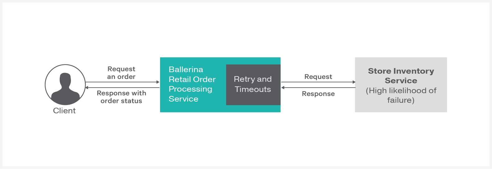

[](https://travis-ci.org/rosensilva/resiliency-circuit-breaker)
# Circuit Breaker
The [circuit breaker pattern](https://martinfowler.com/bliki/CircuitBreaker.html) is a way to automatically degrade functionality when remote services fail. When you use the circuit breaker pattern, you can allow a web service to continue operating without waiting for unresponsive remote services.

> This guide walks you through the process of adding a circuit breaker pattern to a potentially-failing remote backend. 

The following are the sections available in this guide.

- [What you'll build](#what-you-build)
- [Prerequisites](#pre-req)
- [Developing the RESTFul service with circuit breaker](#developing-service)
- [Testing](#testing)
- [Deployment](#deploying-the-scenario)
- [Observability](#observability)

## <a name="what-you-build"></a>  What you'll build

You’ll build a web service that uses the Circuit Breaker pattern to gracefully degrade functionality when a remorte backend fails. To understand this better, you'll be mapping this with a real world scenario of an order processing service of a retail store. The retail store uses a potentially-failing remote backend for inventory management. When a specific order comes to the order processing service, the service calls the inventory management service to check the availability of items.

&nbsp;
&nbsp;
&nbsp;
&nbsp;



&nbsp;
&nbsp;
&nbsp;

**Place orders through retail store**: To place a new order you can use the HTTP POST message that contains the order details

## <a name="pre-req"></a> Prerequisites
 
- JDK 1.8 or later
- [Ballerina Distribution](https://github.com/ballerina-lang/ballerina/blob/master/docs/quick-tour.md)
- A Text Editor or an IDE 

### Optional requirements
- Ballerina IDE plugins ([IntelliJ IDEA](https://plugins.jetbrains.com/plugin/9520-ballerina), [VSCode](https://marketplace.visualstudio.com/items?itemName=WSO2.Ballerina), [Atom](https://atom.io/packages/language-ballerina))
- [Docker](https://docs.docker.com/engine/installation/)

## <a name="developing-service"></a> Developing the RESTFul service with circuit breaker

### Before you begin

#### Understand the package structure
Ballerina is a complete programming language that can have any custom project structure that you wish. Although the language allows you to have any package structure, use the following package structure for this project to follow this guide.

```
└── src
    ├── integrationTests
    │   └── integration_test.bal
    ├── inventoryServices
    │   ├── inventory_service.bal
    │   └── tests
    │       └── inventory_service_test.bal
    └── orderServices
        ├── order_service.bal
        └── tests
            └── order_service_test.bal
```

The `orderServices` is the service that handles the client orders. Order service is configured with a circuit breaker to deal with the potentially-failing remote inventory management service.  

The `inventoryServices` is an independent web service that accepts orders via HTTP POST method from `orderService` and sends the availability of order items.

### Implementation of the Ballerina services

#### order_service.bal
The `ballerina.net.http` package contains the circuit breaker implementation. After importing that package you can directly create an endpoint with a circuit breaker. The `endpoint` keyword in Ballerina refers to a connection with a remote service. You can pass the `HTTP Client`, `Failure Threshold` and `Reset Timeout` to the circuit breaker. The `circuitBreakerEP` is the reference for the HTTP endpoint with the circuit breaker. Whenever you call that remote HTTP endpoint, it goes through the circuit breaker. 


```ballerina
package orderServices;

import ballerina/log;
import ballerina/mime;
import ballerina/net.http;

endpoint http:ServiceEndpoint orderServiceEP {
    port:9090
};

endpoint http:ClientEndpoint circuitBreakerEP {

// The 'circuitBreaker' term incorporate circuit breaker pattern to the client endpoint
// Circuit breaker will immediately drop remote calls if the endpoint exceeded the failure threshold
    circuitBreaker:{
                   // Failure threshold should be in between 0 and 1
                       failureThreshold:0.2,
                   // Reset timeout for circuit breaker should be in milliseconds
                       resetTimeout:10000,
                   // httpStatusCodes will have array of http error codes tracked by the circuit breaker
                       httpStatusCodes:[400, 404, 500]
                   },
    targets:[
            // HTTP client could be any HTTP endpoint that have risk of failure
            {
                uri:"http://localhost:9092"
            }
            ],
    endpointTimeout:2000
};


@http:ServiceConfig {
    basePath:"/order"
}
service<http:Service> orderService bind orderServiceEP {

    @http:ResourceConfig {
        methods:["POST"],
        path:"/"
    }
    orderResource (endpoint httpConnection, http:Request request) {
        // Initialize the request and response message to send to the inventory service
        http:Request outRequest = {};
        http:Response inResponse = {};
        // Initialize the response message to send back to client
        // Extract the items from the json payload
        var result = request.getJsonPayload();
        json items;
        match result {
            json jsonPayload => {
                items = jsonPayload.items;
            }

            mime:EntityError err => {
                http:Response outResponse = {};
                // Send bad request message to the client if request don't contain order items
                outResponse.setStringPayload("Error : Please check the input json payload");
                outResponse.statusCode = 400;
                _ = httpConnection -> respond(outResponse);
                return;
            }
        }

        log:printInfo("Recieved Order : " + items.toString());
        // Set the outgoing request JSON payload with items
        outRequest.setJsonPayload(items);
        // Call the inventory backend through the circuit breaker
        var response = circuitBreakerEP -> post("/inventory", outRequest);
        match response {
            http:Response outResponse => {
            // Send response to the client if the order placement was successful
                outResponse.setStringPayload("Order Placed : " + items.toString());
                _ = httpConnection -> respond(outResponse);
            }
            http:HttpConnectorError err => {
            // If inventory backend contain errors forward the error message to client
                log:printInfo("Inventory service returns an error :" + err.message);
                http:Response outResponse = {};
                outResponse.setJsonPayload({"Error":"Inventory Service did not respond",
                                               "Error_message":err.message});
                _ = httpConnection -> respond(outResponse);
                return;
            }
        }
    }
}
```

Refer to the complete implementaion of the orderService in the [resiliency-circuit-breaker/orderServices/order_service.bal](/orderServices/order_service.bal) file.


#### inventory_service.bal 
The inventory management service is a simple web service that is used to mock inventory management. This service sends the following JSON message to any request. 
```json
{"Status":"Order Available in Inventory",   "items":"requested items list"}
```
Refer to the complete implementation of the inventory management service in the [resiliency-circuit-breaker/inventoryServices/inventory_service.bal](/inventoryServices/inventory_service.bal) file.

## <a name="testing"></a> Testing 


### Try it out

1. Run both the orderService and inventoryService by entering the following commands in sperate terminals from the sample root directory.
    ```bash
    $ ballerina run inventoryServices/
   ```

   ```bash
   $ ballerina run orderServices/
   ```

2. Invoke the orderService by sending an order via the HTTP POST method. 
   ``` bash
   curl -v -X POST -d '{ "items":{"1":"Basket","2": "Table","3": "Chair"}}' \
   "http://localhost:9090/order" -H "Content-Type:application/json"
   ```
   The order service sends a response similar to the following:
   ```
   Order Placed : {"Status":"Order Available in Inventory", \ 
   "items":{"1":"Basket","2":"Table","3":"Chair"}}
   ```
3. Shutdown the inventory service. Your order service now has a broken remote endpoint for the inventory service.

4. Invoke the orderService by sending an order via HTTP method.
   ``` bash
   curl -v -X POST -d '{ "items":{"1":"Basket","2": "Table","3": "Chair"}}' \ 
   "http://localhost:9090/order" -H "Content-Type
   ```
   The order service sends a response similar to the following:
   ```json
   {"Error":"Inventory Service did not respond","Error_message":"Connection refused, localhost-9092"}
   ```
   This shows that the order service attempted to call the inventory service and found that the inventory service is not available.

5. Invoke the orderService again soon after sending the previous request.
   ``` bash
   curl -v -X POST -d '{ "items":{"1":"Basket","2": "Table","3": "Chair"}}' \ 
   "http://localhost:9090/order" -H "Content-Type
   ```
   Now the Circuit Breaker is activated since the order service knows that the inventory service is unavailable. This time the order service responds with the following error message.
   ```json
   {"Error":"Inventory Service did not respond","Error_message":"Upstream service
   unavailable. Requests to upstream service will be suspended for 14451 milliseconds."}
   ```


### <a name="unit-testing"></a> Writing unit tests 


In Ballerina, the unit test cases should be in the same package inside a folder named as 'tests'. The naming convention should be as follows,
* Test functions should contain the test prefix.
  * e.g., testOrderService()

This guide contains unit test cases in the respective packages. The two test cases are written to test the `orderServices` and the `inventoryStores` service.
To run the unit tests, go to the sample root directory and run the following command
```bash
$ ballerina test orderServices/
```

```bash
$ ballerina test inventoryServices/
```

## <a name="deploying-the-scenario"></a> Deployment

Once you are done with the development, you can deploy the service using any of the methods listed below. 

### <a name="deploying-on-locally"></a> Deploying locally
You can deploy the RESTful service that you developed above in your local environment. You can use the Ballerina executable archive (.balx) that you created above and run it in your local environment as follows. 

```
$ ballerina run orderServices.balx 
```


```
$ ballerina run inventoryServices.balx 
```

### <a name="deploying-on-docker"></a> Deploying on Docker
(Work in progress) 

### <a name="deploying-on-k8s"></a> Deploying on Kubernetes
(Work in progress) 


## <a name="observability"></a> Observability 

### <a name="logging"></a> Logging
(Work in progress) 

### <a name="metrics"></a> Metrics
(Work in progress) 


### <a name="tracing"></a> Tracing 
(Work in progress) 
